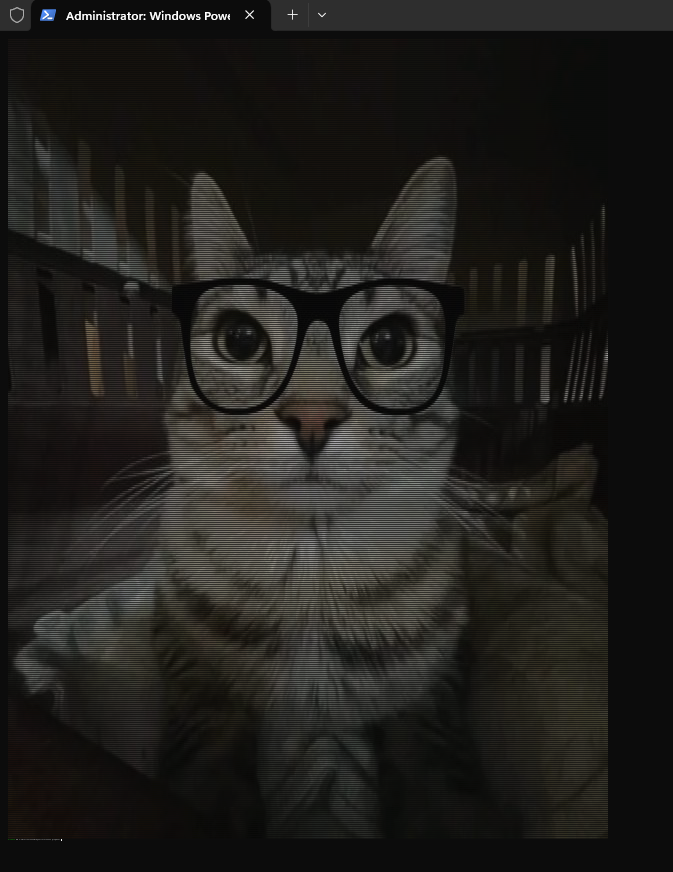

# terminal-image

Display images in your terminal using ANSI true color escape codes.

## Features

- Display PNG/JPG images in the terminal
- ANSI 24-bit true color support (works in most modern terminals)
- Automatically fits image to terminal size
- Simple CLI usage

## Installation

Install using pip:

```
pip install terminal-image
```

Or install locally from source:

```
git clone https://github.com/Soundhearddev/terminal-image.git
cd terminal-image
pip install -e .
```

## Usage

Display an image in the terminal:

```
timage path/to/image.png
```

You can also add an optional delay (in seconds) before the program starts:

```
timage path/to/image.png 5
```
 
### preview

| Original image            | Terminal output                    |
|---------------------------|------------------------------------|
|     |    |

## Requirements

- Python 3.7+
- A terminal that supports ANSI true color
- opencv-python


